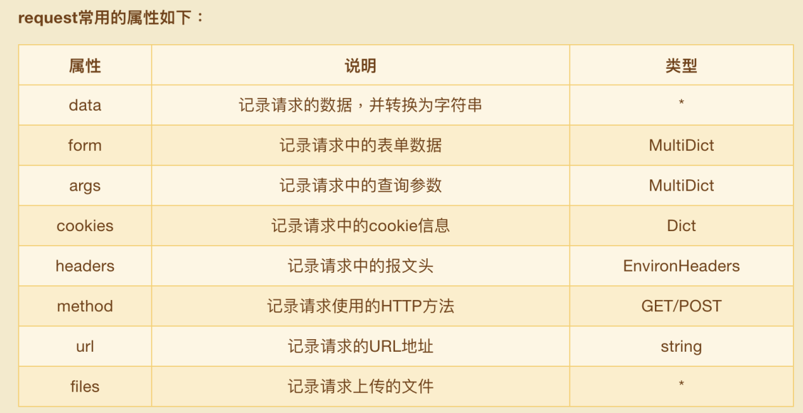

# flask

### 1.初始化

- 初始化参数
    ~~~python
    import flask
    app = flask(
        __name__, # 模块名
        static_url_path: 'static', # 静态资源url访问前缀，默认为static
        static_folder: 'static', # 静态资源文件夹，默认为static
        template_folder: 'templates' # 模板文件存放文件夹，默认为template
    )
    ~~~

- 参数配置

  + 方法一：`app.config.from_pyfile(<filename>)`,从配置文件中导入配置项

  + 方法二：`app.config.from_object()`,从类对象中导入配置项

    ~~~python
    class Config():
        	DEBUG = True
            ...
    app.config.from_object(Config)
    ~~~

  + 方法三：`app.config[配置名]=<value>`

- 读取参数配置

  + `app.config.get(<field_name>)`
  + `current_app.config.get(<field_name>)`, `current_app`是从flask中导入的一个特殊对象，它指向当前所在的`app`

- 启动

  + `app.run(host=<ip>, port=<port>)`

  + 借助`Flask-Script`来扩展命令行指令（在flask1.0不支持开启debug）

    ~~~python
    from flask_script import Manager
    manager = Manager(app)
    manager.run()
    ~~~

  + `flask1.0`运行应用

    ~~~shell
    $ export FLASK_APP = <filename>  # 指定flask app的文件名
    $ export FLASK_ENV = development # 设置为开发环境（自动重启，debug）
    $ flask run [--port <port>] [--host <ip>] # 运行flask应用
    ~~~

### 2.路由和视图

- 自定义转换器

  ~~~python
  from flask import Flask
  from werkzeug.routing import BaseConverter
  class RegexConverter(BaseConverter):
      def __init__(self, url_map, *args):
          super().__init__(url_map)
          self.regex = args[0] # 用于提取url参数的正则表达式
      def to_python(self, value):
          return value # 返回url提取到的参数
      
      def to_url(self, value):
          return value # 使用url_for时会被调用
      
  app = Flask(__name__)
  app.url_map.converters['re']=RegexConverter
  @app.route('/hello/<re(ur"^[\w\d]*@.*$"):mail>')
  def hello(mail):
      return 'hello {}'.format(mail)
  ~~~

- 获取请求参数

  + `from flask import request`,request对象中保存了当前请求上下文

    

- 异常处理

  + `from flask import abort`

  + `abort(<status_code>)`,传入响应的状态码，flask自动中止本次请求并返回响应报文

  + 自定义异常处理

    ~~~python
    @app.errorhandler(404)
    def error(e):
        return '您请求的响应不存在%s' % e
    ~~~

- 返回响应

  + 方式1：return 响应元组，元组的格式为：`(content, status, headers)`,headers可以是字典或者列表

  + 方式2：通过`make_reponse`方法生成一个response对象

    ~~~python
    res = make_response(<content>)
    res.headers['Server']='nginx'
    res.status='404 NOT FOUND'
    ~~~

  + 返回`json`应答：`return jsonify(**kwargs)`

  + 重定向：`return redirect(<url>)`

  + 设置`cookie`

    ~~~python
    res = make_response()
    res.set_cookie(key, value[, max_age=<seconds>]) # 设置cookie
    res.delete_cookie(key) # 删除cookie
    ~~~

  + 设置`session`

    ~~~python
    from flask import session
    app.config['SECRET_KEY'] = value
    session[key] = value # flask中默认将session的数值,经过SECRET_KEY混淆之后存在cookie中
    ~~~

  + 请求上下文与应用上下文

    + `request`
    + `session`
    + `g`:用于存储值的临时对象，每次处理新的请求都重置这个对象

  + 请求钩子

    + 在处理第一个请求前运行：`@app.before_first_request`
    + 在每次请求前运行：`@app.before_request`
    + 在每次请求后（执行完视图函数，且为出现异常）运行：`@app.after_request(response)`
    + 在每次请求后运行（执行完视图函数，无论是否出现异常）：`@app.teardown_request(response)`

### 3.jinja2模板引擎

- 自定义过滤器

  ~~~python
  def custom_filter(value):
      return value
  app.add_template_filter(custom_filter, '过滤器名')
  #######################
  @app.template_filter('过滤器名')
  def custom_filter(value):
      return value
  ~~~

- 使用Flask-WTF扩展

- 宏定义

- 模板中使用的特殊变量和方法

  + `config`
  + `request`
  + `url_for` 

### 4. flask-migrate

- 初始化

  ~~~python
  from flask_migrate import Migrate
  ...
  migrate = Migrate(app, db)
  ~~~

- 常用指令

  ~~~shell
  $ flask db init # 初始化迁移仓库
  $ flask db migrate [-m '信息']# 生成迁移文件
  $ flask db upgrade # 迁移到数据库
  $ flask db history # 产看历史版本
  $ flask db downgrade <版本号> # 版本降级
  ~~~
